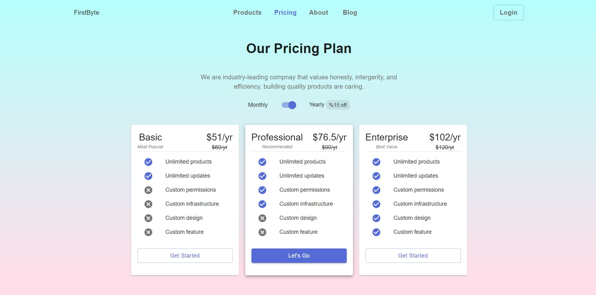

<h2 align="center">UI to Code Day 1</h2>


<br />

### Tech Stack


## Getting Started

### Install the dependency

```bash
yarn 
```

### Run development

```bash
yarn dev
```

### Build
```bash
yarn build
```

### Start
```bash
yarn start
```

